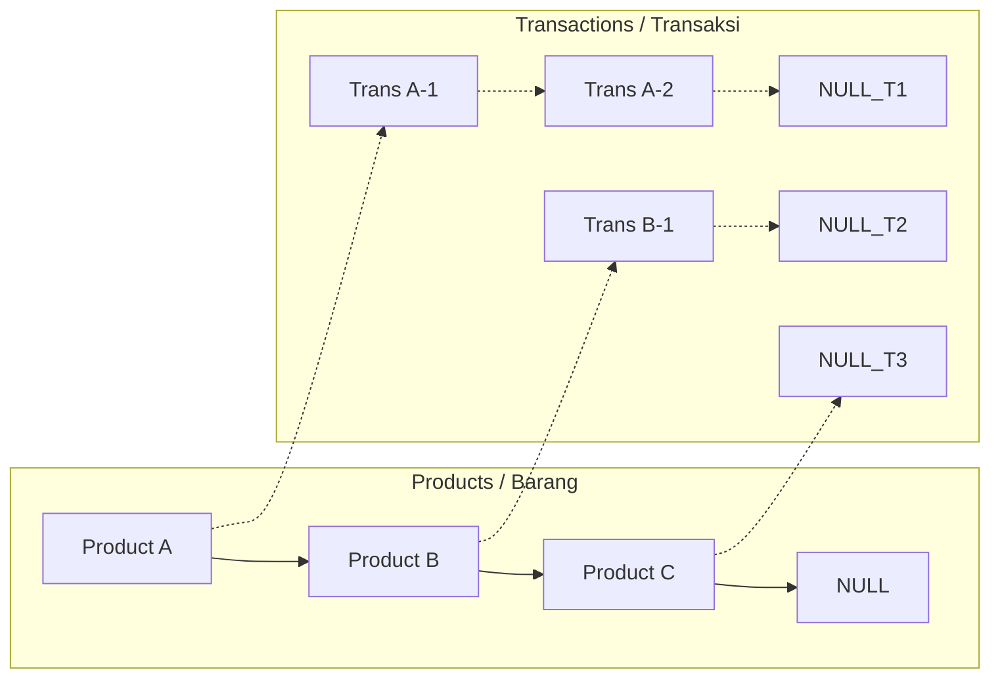

# Simple E-Commerce System (C++ Multilevel Linked List)


A console-based E-Commerce system developed to demonstrate the implementation of advanced **Data Structures** using C++. This program efficiently manages product data (`Barang`) and sales transactions (`Transaksi`) using a hierarchical **Multilevel Linked List**.

## 📖 Project Overview

This application simulates a backend system for managing e-commerce inventory and sales. It implements a **One-to-Many** relationship where a single Product (Parent Node) can hold multiple Transactions (Child Nodes).

The primary goal of this project is to demonstrate dynamic memory management, pointer manipulation, and CRUD operations within a complex linked list structure.

### Core Concepts Implemented:
* **Single Linked List:** Used for the main list of Products.
* **Multilevel Linked List:** Connects Transactions to specific Products (Parent-Child relationship).
* **Dynamic Memory Allocation:** Utilizes `new` and `delete` for efficient node management.

## 🗂 Data Structure Architecture

The system visualizes data hierarchically as follows:


- Barang (Parent Node): Contains id, name, price, next pointer (to next product), and child pointer (to transactions).
- Transaksi (Child Node): Contains id, quantity, totalPrice, and next/prev pointers.
- 
✨ Key Features
📦 Product Management (Parent)
- Insert: Add products at the beginning (Insert First) or end (Insert Last) of the list.
- View: Display all registered products.
- Search: Find specific products by ID.
- Update: Modify product details (Name, Price).
- Delete: Remove a product (automatically cascades and deletes all associated transactions to prevent memory leaks).
- 
🛒 Transaction Management (Child)
- Add Transaction: Create a new transaction for a specific product.
- Auto-calculation: Automatically calculates Total Price based on Quantity * Product Price.
- View Hierarchy: Display products together with their complete transaction history.
- Search: Find specific transactions within a product.
- Update: Edit transaction quantity (triggers automatic total price recalculation).
- Delete: Remove a specific transaction from a product.
  
📊 Reporting
Calculation: Calculate the total revenue/value of all transactions for a specific product.
```
🛠️ Project Structure
Ensure your source files are organized as follows:

Plaintext
├── main.cpp          # Main program entry point (Menu loop)
├── e_commerce.cpp    # Implementation of functions and logic
├── e_commerce.h      # Header file (Struct definitions and prototypes)
└── README.md         # Project documentation
```
🚀 How to Run
Prerequisites
You need a C++ compiler installed (e.g., G++, Clang, or MSVC).

1. Compile
Open your terminal and run the following command to link and compile the files:

Bash
g++ main.cpp e_commerce.cpp -o ecommerce

2. Execute
Run the generated executable:

Windows:

Bash
ecommerce.exe
Linux / macOS:

Bash
./ecommerce
```
📋 Usage Example
Upon running the program, you will use the interactive menu:

Plaintext
=== MENU E-COMMERCE ===
1. Tambah Barang (Depan)       # Add Product (Front)
2. Tambah Barang (Belakang)    # Add Product (Back)
3. Tampilkan Semua Barang      # Show Products
4. Tambah Transaksi ke Barang  # Add Transaction
5. Tampilkan Barang & Transaksi# Show Hierarchy
...
12. Hitung Total Transaksi     # Calculate Total
0. Keluar                      # Exit
Typical Workflow:
Step 1: Add a product using option 1 or 2.
Step 2: Add a transaction to that product using option 4 (You will need the Product ID).
Step 3: View the data structure using option 5.
```
👨‍💻 Author
Faisal Surya Saputra
Institution: Telkom University
Major: Informatics (S1 Informatika)
GitHub: @faisalsuryasaputra

This project was created for the Data Structures course final assignment.
